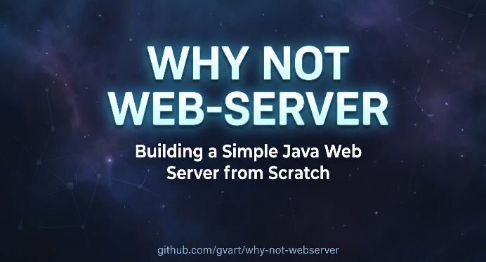

# Why not web-server

Why not web-server is an experiment where I try to build a web server from scratch using Java.

The goal is a web server that can handle HTTP/1.1 and HTTP/2 traffic (and maybe HTTP/3), wrapped up as a Spring Boot starter.

## How to use this repo

I write a series of blog posts about my adventure. Each post has its own branch, while `main` is reserved for the changes that make it into the final solution.

| # | Post                                                                                 | Branch                                                                                                 |
|---|--------------------------------------------------------------------------------------|--------------------------------------------------------------------------------------------------------|
| 0 | [Foundation](https://gvart.dev/posts/post/2026/08/why_not_web_server_part_0_basics/) | [`why-not-webserver-part-0`](https://github.com/gvart/why-not-webserver/tree/why-not-webserver-part-0) |
| 1 | NIO, selectors & the event loop - scale up connections in a non-blocking way         | TBD                                                                                                    |
| 2 | Java 25 concurrency: virtual threads vs. the event loop, let's simplify things       | TBD                                                                                                    |
| 3 | Make it work - the DIY web server with HTTP/1.1 support                              | TBD                                                                                                    |
| 4 | Is it realtime now? - the DIY web server with WebSocket support                      | TBD                                                                                                    |
| 5 | Go binary - the DIY web server with HTTP/2 support                                   | TBD                                                                                                    |
| 6 | (maybe) Wow, that's ambitious - QUIC + HTTP/3                                        | TBD                                                                                                    |
| 7 | I finally made it - the Spring Boot starter and testing results                      | TBD                                                                                                    |
