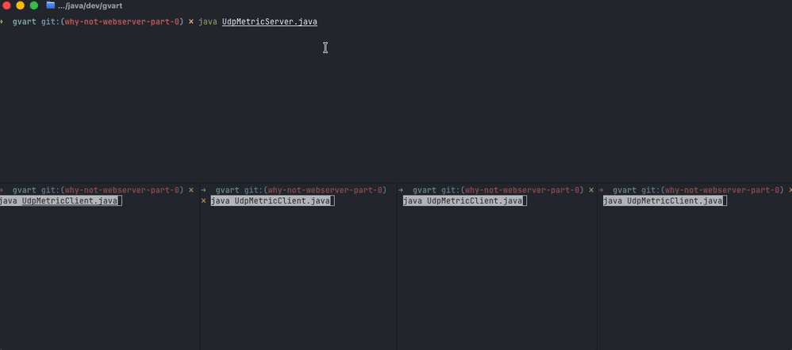

# Why not web-server

Two small networking demos in plain Java 25 - one over TCP, one over UDP. No framework, no
dependencies, no build step. Every file is a compact source file you run directly with `java`.

| Demo                        | Protocol | Port | What it shows                                                                   |
|-----------------------------|----------|------|---------------------------------------------------------------------------------|
| [TCP Chat](#tcp-chat)       | TCP      | 6666 | A connection per client, a virtual thread per connection, a chat application    |
| [UDP Metrics](#udp-metrics) | UDP      | 7777 | One socket for every client, fire-and-forget packets, a live terminal dashboard |

## TCP Chat

* [`TcpChatServer.java`](src/main/java/dev/gvart/TcpChatServer.java)
* [`TcpChatClient.java`](src/main/java/dev/gvart/TcpChatClient.java)

A terminal chat room. The server accepts connections and hands each socket to a virtual thread, so
one thread per client costs almost nothing. Clients send their username as the first line, then
every line after that gets broadcast to everyone else.

## UDP Metrics

* [`UdpMetricServer.java`](src/main/java/dev/gvart/UdpMetricServer.java)
* [`UdpMetricClient.java`](src/main/java/dev/gvart/UdpMetricClient.java)

A monitoring dashboard. Each client reports CPU, RAM and HDD readings every 2.5 seconds as a single
datagram. The server holds the latest reading per service and repaints a table in place:

Nothing is acknowledged and nothing is retried. A lost packet just means one stale row until the
next tick - which is exactly the tradeoff that makes UDP the right fit for telemetry.

## Requirements

JDK 25, for compact source files and instance `main` methods. Gradle is included only for
[Spotless](https://github.com/diffplug/spotless) formatting - you never need it to run the demos.